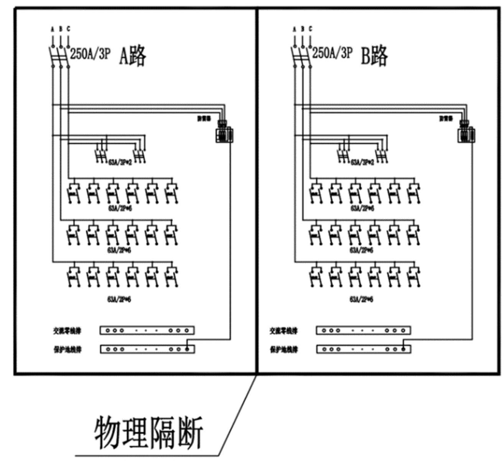

# 一、赛题背景 
低压电气成套设备广泛应用于数据中心、医院、学校、工业厂房、市政设施和商业建筑等场景。一个成套项目通常包含多台低压柜、中压柜、变频柜、MCC 柜、配电箱或电罩箱。项目报价人员需要阅读电气图纸（图 1）、技术规范、配置说明、设备清单和主元器件清单，再结合柜型规则、品牌约束、物料配置规则和价格信息，逐台柜子编制 BOM 和报价清单。 

图 1 交流列头柜电器图纸 
实际业务中，低压成套报价存在以下典型痛点：
- 1. 资料类型多：询价资料可能包含 DWG/PDF 图纸、Excel 主元器件清单、Word 配置说明、图片截图等，报价清单则是系统需要生成的输出结果。
- 2. 模板不统一：不同项目、不同客户、不同工程师提供的清单格式差异较大。
- 3. 识别成本高：柜号、柜型、额定电流、回路数、主元件品牌、长交期物料等信息分散在多种资料中。
- 4. 经验依赖强：报价人员需要根据柜型、接地方式、防护等级、进出线方式、行业场景和品牌要求补充辅材和典型配置。
- 5. 变更频繁：询价资料更新后，报价清单需要快速定位受影响的柜体和物料，避免漏改、错改
- 6. 校验困难：人工报价容易出现缺项、重复项、数量异常、品牌不一致、柜号不匹配等问题。

本次比赛课题聚焦工业软件领域，旨在激发大学生在真实制造与工程报价场景中的实践探索和创新思维。参赛者需要综合运用数据解析、规则建模、算法优化、自然语言处理、视觉识别、大模型应用、知识库检索和软件工程能力，为低压电气成套行业提供一个可落地的智能报价清单生成系统。
通过解答本试题，学生将理解工业软件中“非标准资料结构化、业务规则显式化、AI 结果可追溯、人机协同闭环”的核心问题，训练从真实工程资料到可交付软件原型的完整能力。

# 二、赛题描述

参赛者需要设计并实现一个低压电气成套项目智能报价清单生成系统。系统应能够基于给定项目输入资料，自动或半自动生成结构化项目数据、逐柜 BOM、项目汇总 BOM、报价清单和校验报告。
正式输入资料包括但不限于：
- 1. 项目图纸：DWG、PDF、图片等格式，可包含一次系统图、二次图、平面图、布置图、目录、图例和技术说明。
- 2. 主元器件清单：Excel 格式，通常包含设备编号、柜号、元器件名称、型号及规格、单位、数量、生产厂家、长交期标记等字段。
- 3. 技术或配置说明：Word/PDF 格式，可能包含品牌、柜型、接地方式、防护等级、使用环境、配置范围、供货边界等约束。
- 4. 设备清单或客户需求表：Excel/Word/PDF 格式，可能包含设备位号、设备名称、功率、电压、控制方式等信息。
注意：报价单或历史报价结果不作为正式输入。可将其作为参考答案或评分基准，用于评价系统生成结果的正确性和完整性。

系统需要围绕以下任务展开：
- 1. 项目资料解析：识别上传资料的类型、项目名称、标段、柜体范围和关键约束，形成项目资料索引。
- 2. 柜体清单生成：从图纸或清单中抽取柜号、柜型、外形尺寸、数量、额定电流、进出线方式、应用场景等信息。
- 3. 逐柜 BOM 生成：按柜体生成元器件明细，至少包含物料名称、规格型号、单位、数量、品牌或厂家、来源依据。
- 4. 物料归一与匹配：对不同项目中写法不一致的元件名称、型号规格、品牌进行规范化和相似匹配。
- 5. 项目汇总  BOM：合并相同或相似物料，输出项目级采购/报价汇总清单。
- 6. 报价清单生成：在给定价格规则、价格样例或模拟价格字段的情况下，计算柜体小计、项目合计，并支持按标段或柜体维度汇总。
- 7. 质量校验：识别缺项、重复项、数量异常、柜号不匹配、品牌约束冲突、长交期风险、图纸与主元件清单不一致等问题。
- 8. 人机协同修正：允许用户查看  AI/算法生成依据，手工调整柜体和  BOM，调整后可重新导出结果。
- 9.结果导出：导出结构化 Excel 或 JSON，并提供简要分析报告。
# 三、业务规则与约束参考
参赛者可根据资料和业务理解自行扩展规则，但至少应覆盖以下约束：
- 1. 柜号一致性：同一柜号在图纸、主元件清单、设备清单和配置说明中应能建立对应关系。
- 2. 柜型影响 BOM：进线柜、出线柜、母联柜、MCC 柜、变频柜、补偿柜、ATS 柜等不同柜型对应不同典型物料构成。
- 3. 额定电流影响规格：额定电流会影响主断路器、互感器、铜排、母排、柜体配置等规格选择。
- 4. 接地方式影响物料：TN-S、TN-C、TN-C-S、TT、IT 等接地方式会影响 N 排、PE 排、PEN 排、RCD、绝缘监测等配置。
- 5. 进出线方式影响辅材：电缆上进/下进、母线槽接入、背靠背拼柜等方式会影响电缆夹具、支架、过渡母排和绝缘件。
- 6. 品牌约束优先：图纸、技术规范或配置说明中的指定品牌优先级高于历史推荐。
- 7. 长交期物料提示：主元器件清单中标记为长交期的物料应在结果中单独提示。
- 8. 项目变更可追溯：若存在不同版本资料，应能够标记新增、删除或变更的柜体和元件。
- 9. 人工确认优先：经用户确认或修正的数据应优先于  AI  自动识别结果。
- 10. 结果依据可解释：每条关键 BOM 记录应能说明来源，如“图纸识别”“主元件清单抽取”“技术规范约束”“历史案例参考”“规则推算”“人工修正”等。

# 四、比赛要求
- 1. 算法与 AI 实现：系统需包含资料解析、柜体识别、BOM 生成、物料归一、报价清单生成、结果校验等关键功能。可采用传统算法、机器学习、OCR/视觉模型、大模型、RAG、规则引擎或混合方案。
- 2. 数据结构设计：设计合理的数据结构来存储项目、输入资料、柜体、物料、报价清单、规则、参考案例和校验结果。
- 3. 工程化实现：实现一个可运行的软件原型。推荐  B/S  模式，也可采用命令行加可视化报告形式。系统应能导入样例数据并输出结果。
- 4. 可解释性：输出结果应保留来源依据、置信度或校验说明，避免只给出不可追踪的最终答案。
- 5. 人机协同：系统应支持对柜体和  BOM  结果进行人工确认、修改或补充，并保留修改后的导出结果。
- 6. 性能评估：提供处理效率、准确率、召回率、错误类型分析和复杂项目运行表现。
- 7. 创新性：鼓励使用大模型、多模态识别、知识库增强、历史结果学习、规则自动抽取、变更影响分析等创新方法。
- 8. 文档完整性：提供需求理解、系统设计、数据结构、核心算法、测试方法、部署说明和结果分析报告。
# 五、基础任务、进阶任务与挑战任务
## 基础任务
- 1. 读取给定  PDF/图片图纸、Excel  主元器件清单或配置说明，抽取柜体清单和逐柜  BOM。
- 2. 对物料名称、规格型号、品牌、单位、数量进行结构化整理。
- 3. 输出项目汇总 BOM 和基础统计结果。
- 4. 识别柜号缺失、数量为空、重复物料、品牌字段缺失等基础质量问题。
- 5. 按指定模板导出 Excel 或 JSON。

## 进阶任务
- 1. 支持从  PDF/图片图纸中识别柜体区域、柜号、柜型、回路信息或关键参数。
- 2. 基于历史报价结果或参考案例进行相似柜体检索，为新柜体推荐典型  BOM。
- 3. 建立物料规范化词典，实现相似物料合并和规格型号解析。
- 4. 支持技术规范/配置说明中的品牌、防护等级、接地方式等约束抽取。
- 5. 对图纸、主元件清单和配置说明进行一致性校验，输出差异报告。

## 挑战任务
- 1. 支持 DWG 自动转换、图元解析或高质量页面渲染。
- 2. 对比不同版本询价资料，自动生成变更影响清单。
- 3. 对长交期物料、品牌约束冲突、数量异常进行风险分级。
- 4. 支持用户在界面中框选图纸区域、修正柜号或  BOM，并将修正结果沉淀为经验。
- 5. 基于历史项目自动学习柜型到典型 BOM 的配置规则。
- 6. 输出可解释的报价建议报告，说明关键差异、风险和需要人工确认的事项。
# 六、输出结果要求
参赛系统至少应输出以下内容：
- 1. 项目资料解析结果：文件清单、文件类型、识别到的项目约束。
- 2. 柜体清单：柜号、柜型、尺寸、数量、额定电流、来源文件、识别置信度或备注。
- 3. 逐柜  BOM：柜号、物料名称、规格型号、单位、数量、品牌/厂家、来源依据、风险提示。
- 4. 项目汇总  BOM：按物料名称、规格型号、品牌合并后的数量汇总。
- 5. 报价清单结果：在样例价格可用时输出单价、合价、小计、总价；若价格不可用，可输出成本项结构和缺价提示。
- 6. 校验报告：缺项、重复项、数量异常、品牌冲突、柜号不匹配、长交期物料和资料版本差异。
- 7. 系统运行说明：如何导入数据、执行识别、查看结果和导出文件。
# 七、提交内容
- 1. 源代码：完整的系统实现代码，包含前端、后端、算法脚本或模型调用代码。
- 2. 可运行程序：提供本地运行说明、依赖安装方式和示例启动命令。
- 3. 设计文档：说明需求理解、架构设计、数据结构、核心流程、算法选择和关键规则。
- 4. 测试报告：包含不同项目、不同资料组合、异常数据和变更数据的测试结果。
- 5. 性能评估报告：包含识别准确率、字段召回率、物料匹配准确率、运行时间和资源消耗。
- 6. 输出样例：至少提交一个项目的柜体清单、逐柜BOM、汇总BOM、报价清单和校验报告。
- 7. 演示材料：可选提交系统截图、演示视频或答辩PPT。
# 八、评分标准
- 1. 业务正确性（30%）：能否从输入资料准确抽取柜体、BOM、项目约束并生成报价清单关键字段；能否识别常见质量问题。
- 2. 算法与智能化能力（20%）：资料解析、视觉识别、物料归一、相似检索、规则推理、变更分析等能力的有效性。
- 3. 工程实现质量（20%）：系统可运行性、模块化、代码质量、数据结构设计、导入导出能力和异常处理。
- 4. 可解释性与人机协同（10%）：结果来源是否清晰，是否支持人工确认、修改和复核。
- 5. 性能效率（10%）：处理速度、资源消耗、复杂项目数据下的稳定性。
- 6. 创新性（10%）：是否提出有价值的新方法，如 RAG 知识库、自动规则学习、多模态识别、报价风险分级、经验沉淀等。

# 九、附加信息
- 1. 参赛者需在截止日期前提交规定的内容。
- 2. 参赛者可以组队参赛，每队不超过 3 人。
- 3. 所有提交内容需为原创，不得抄袭或侵犯他人知识产权。
- 4. 如使用大模型、OCR、视觉模型或第三方算法库，需在文档中说明调用方式、模型名称、使用边界和替代方案。
- 5. 允许参赛者使用开源模型或商业 API，但评分更关注系统设计、业务理解、结果质量和工程实现，而非单一模型能力。